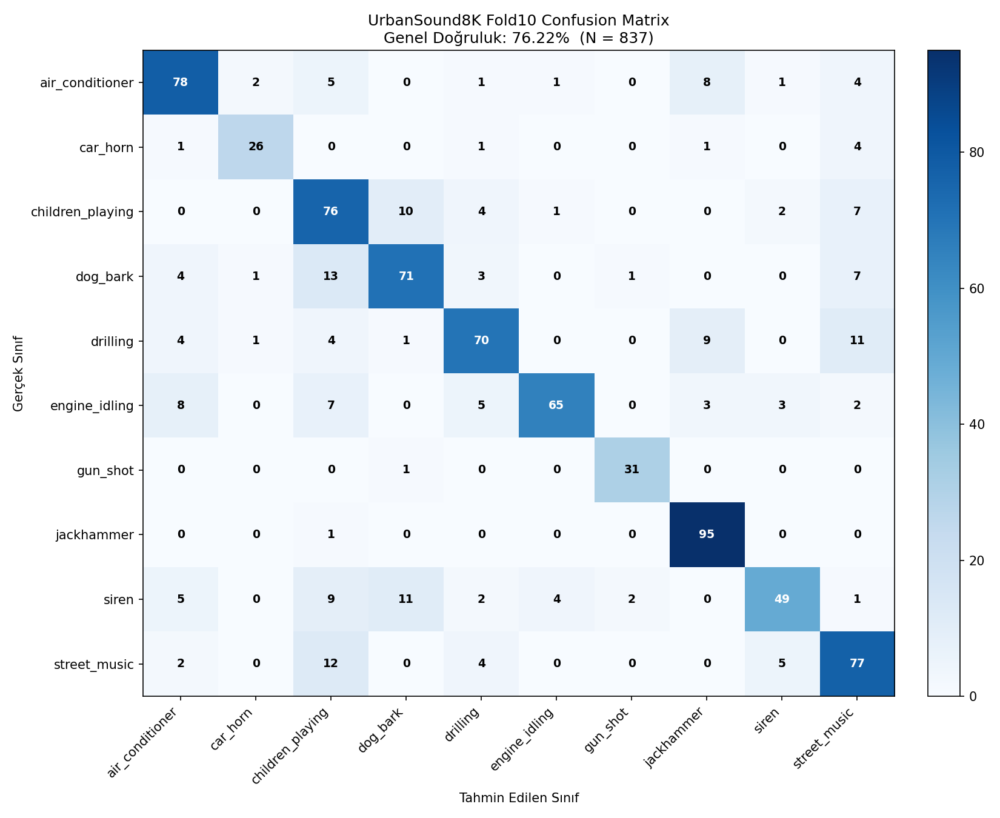

# Model Doğruluk Değerlendirmesi

## Test Kurulumu
- Veri seti: **UrbanSound8K**
- Test seti: **Fold 10** (eğitimde kullanılmadı)
- Toplam test örneği: **837**
- Model: `model.tflite` (TFLite float32, 4 thread)
- Inference süresi: 21.1 sn (~25.2 ms/örnek, batch=1)
- Preprocessing: 64-band Mel spectrogram, Slaney norm, dB ölçek (`librosa.power_to_db(ref=np.max)`)
- Normalizasyon: min-max  `x_min = -80.0`, `x_max = 3.815e-06`

## Sonuçlar

### Genel Doğruluk
**Test Doğruluğu (Accuracy): %76.22**

### Sınıf Bazlı Performans

| Sınıf | Precision | Recall | F1-Score | Örnek Sayısı |
|---|---|---|---|---|
| air_conditioner | 0.7647 | 0.7800 | 0.7723 | 100 |
| car_horn | 0.8667 | 0.7879 | 0.8254 | 33 |
| children_playing | 0.5984 | 0.7600 | 0.6696 | 100 |
| dog_bark | 0.7553 | 0.7100 | 0.7320 | 100 |
| drilling | 0.7778 | 0.7000 | 0.7368 | 100 |
| engine_idling | 0.9155 | 0.6989 | 0.7927 | 93 |
| gun_shot | 0.9118 | 0.9688 | 0.9394 | 32 |
| jackhammer | 0.8190 | 0.9896 | 0.8962 | 96 |
| siren | 0.8167 | 0.5904 | 0.6853 | 83 |
| street_music | 0.6814 | 0.7700 | 0.7230 | 100 |
| **Macro Avg** | 0.7907 | 0.7755 | 0.7773 | 837 |
| **Weighted Avg** | 0.7731 | 0.7622 | 0.7614 | 837 |

### Confusion Matrix

### Yorum
**En yüksek başarılı sınıflar (recall):**
- `jackhammer` → recall %99.0, F1 %89.6
- `gun_shot` → recall %96.9, F1 %93.9
- `car_horn` → recall %78.8, F1 %82.5

**En düşük başarılı sınıflar:**
- `drilling` → recall %70.0, F1 %73.7
- `engine_idling` → recall %69.9, F1 %79.3
- `siren` → recall %59.0, F1 %68.5

Fold 10'da en düşük performans gösteren `drilling` sınıfı %70.0 recall ile diğer sınıflara göre belirgin biçimde geride kalmıştır. Bu durum genellikle (i) sınıfın UrbanSound8K içinde dağılımının dengesiz olması, (ii) 1 saniyelik pencerede sınıfın ayırt edici akustik motiflerinin zaman zaman kesilmesi ve (iii) spektrum açısından komşu sınıflarla örtüşme ile açıklanabilir.

**En çok karışan sınıf çiftleri (gerçek → tahmin):**
- `dog_bark` ↔ `children_playing` (13 örnek)
- `street_music` ↔ `children_playing` (12 örnek)
- `drilling` ↔ `street_music` (11 örnek)
- `siren` ↔ `dog_bark` (11 örnek)
- `children_playing` ↔ `dog_bark` (10 örnek)

Karışıklıkların büyük kısmı spektral olarak benzer makinesel/sürekli kaynaklı seslerde (örn. `air_conditioner`, `engine_idling`, `jackhammer`, `drilling`) ortaya çıkmaktadır; bu Mel spektrogram tabanlı modellerde literatürde de raporlanan bilinen bir kısıttır.

### Üretilen Çıktılar
- `analysis_output/confusion_matrix.png`
- `analysis_output/classification_report.txt`
- `model_evaluation.md` (bu dosya)